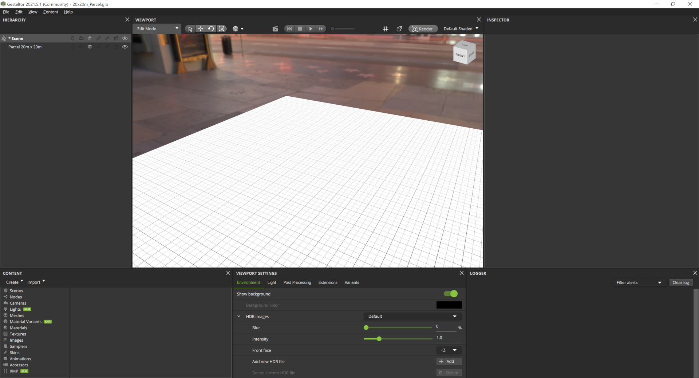

# Gestaltor in the Metaverse
[Gestaltor](https://gestaltor.io/) is the first visual [glTF](https://www.khronos.org/gltf/) editor. One of the main features is, that glTF is loaded and saved (and not imported and exported).  
This is a big advantage, as any information stored in the glTF is not lost.  
  
glTF is the format of choice in the metaverse and [3D Commerce](https://www.khronos.org/3dcommerce/) and we continously add new features to Gestaltor, to fulfill the demands from the community.  
  
Following assets do help to create content using Gestaltor for the following Metaverse platforms.

## General

In general, meters are also used as units in virtual space and the metaverse.  
Following ruler does have a size of 0.1 x 2.0 x 0.1 meters, which does easily allow size comparisson.  
In this scene, an avatar from [Ready Player Me](https://readyplayer.me/) and a chair from [wayfair](https://www.aboutwayfair.com/tech-blog/welcome-to-wayfairs-realtime-3d-model-api) are compared:  

* Download [Ruler_2m.glb](General/Ruler_2m.glb)  

## Decentraland
In [Decentraland](https://decentraland.org/) it is possible to add own 3D models using glTF.  

### LAND
3D models can be placed on a [LAND](https://docs.decentraland.org/decentraland/faq/#what-is-land) estate. A LAND estate does have a dimension of [16m x 16m](https://docs.decentraland.org/decentraland/faq/#how-large-is-a-tile-of-land).  
The following asset does have a dimension of 16m x 16m in glTF plus a checkerboard texture of 1m x 1m:

* Download [1x1LAND.glb](Decentraland/1x1LAND.glb)  

## Somnium Space
In [Somnium Space](https://somniumspace.com/) it is possible to upload and download 3D models using glTF.  

### Parcels
3D models can be placed on a Parcel. A Parcel can be of size [S, M and XL](https://somniumspace.medium.com/everything-you-need-to-know-about-buying-land-parcel-in-somnium-space-4f66d18c1a73).  
The following assets are the basement of each Parcel:

* Download [ParcelS.glb](SomniumSpace/ParcelS.glb)  
* Download [ParcelM.glb](SomniumSpace/ParcelM.glb)  
* Download [ParcelXL.glb](SomniumSpace/ParcelXL.glb)  

## Substrata
In [Substrata](https://substrata.info/) it is possible to upload 3D models using glTF.  

### Parcels
3D models can be placed on a Parcel in Substrata. A Parcel does have a size of 20m x 20m:

* Download [20x20m_Parcel.glb](20x20m_Parcel.glb)  
